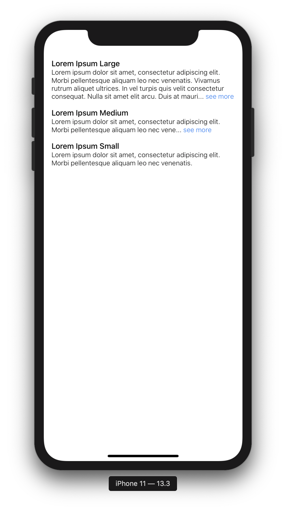
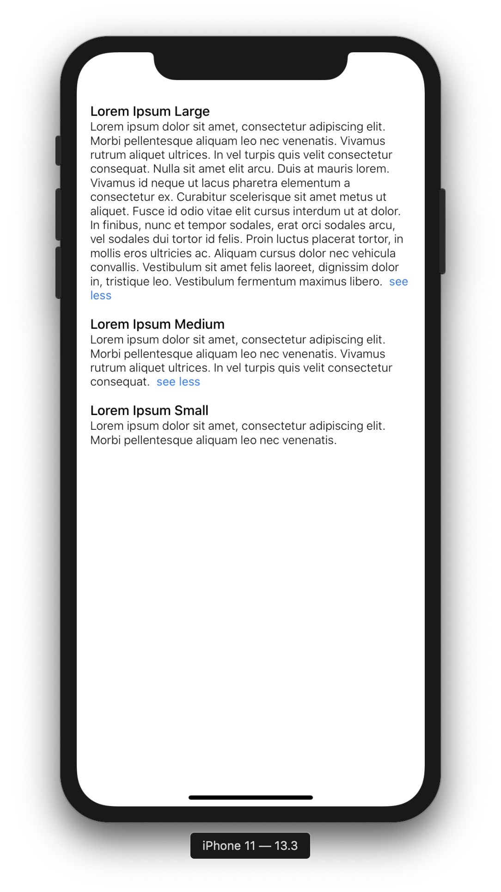
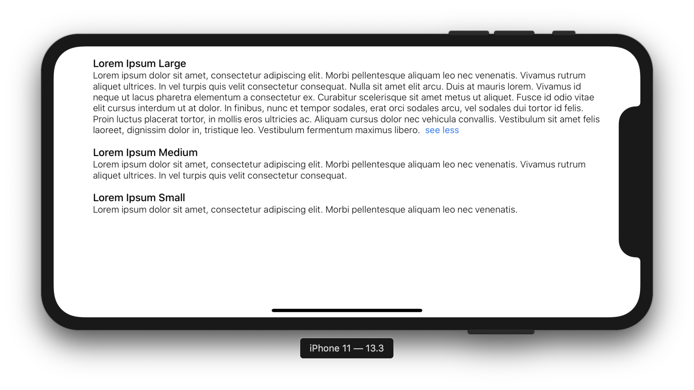

# react-native-see-more-inline

Show a "read more", "see more", "read less", "see less" inline with your text in React Native

>My motivation of building this was that I couldn't find any library/implementation that would place the "see more" link inline with the text. All the other implementations I found would place the link under the text. This package uses text width, and using a simple binary search it (almost) accurately calculates where it should place the "see more" link.





## Installing the package
1. Install [`react-native-text-size` v4.0.0-rc.1](https://github.com/aMarCruz/react-native-text-size)
2. `yarn add react-native-see-more-inline` or `npm install --save react-native-see-more-inline`

>Note: This package will not work with expo managed projects. The dependency `react-native-text-size` links natively. Till we have a dependency on this package to measure the text width, this limitation will remain.

## Usage
```
import SeeMore from 'react-native-see-more-inline';

<SeeMore numberOfLines={2}>
  {VERY_LARGE_TEXT}
</SeeMore>

<SeeMore numberOfLines={2} linkStyle={{ fontWeight: '500' }}>
  {VERY_LARGE_TEXT}
</SeeMore>
```

### Props
| Prop             | Default Value | Required | Type   |
|------------------|---------------|----------|--------|
| numberOfLines    | -                                                            | yes | number       |
| linkColor        | '#2E75F0'                                                    | no  | string       |
| linkPressedColor | '#163772'                                                    | no  | string       |
| linkStyle        | undefined                                                    | no  | array/object |
| seeMoreText      | 'see more'                                                   | no  | string       |
| seeLessText      | 'see less'                                                   | no  | string       |
| style            | `{ fontFamily: undefined, fontSize: 14, fontWeight: '300' }` | no  | array/object |


## Running the example
1. `cd example`
2. `yarn install`
3. Terminal 1 - `yarn start`
4. Terminal 2 - `yarn run wml`
5. Terminal 3 - `yarn run ios` / `yarn run android`
